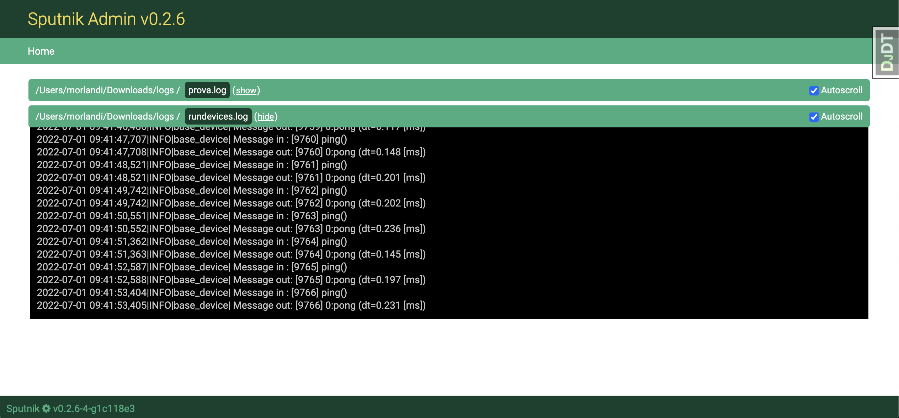

## Django AdminLogViewer

Allows the viewing and download of specific log files in real time directly from the Django admin interface.

Inspired by [Django LogTailer](https://github.com/fireantology/django-logtailer)

Features:

- log files will be shown incrementally in "follow mode"
- the whole log file can be downloaded for later inspection
- no Django Models are installed
- the list of viewable log files is hardcoded in Django settings for security reasons


### Quick start

1) Install Django LogViewer:

```
pip install django-admin-logviewer
```

2) Add it to your `INSTALLED_APPS`:


```
    INSTALLED_APPS = (
        ...
        'logviewer',
        ...
    )
```

3) Add Django LogViewer's URL patterns:


```
    urlpatterns = [
        ...
        path('logviewer/', include('logviewer.urls', namespace='logviewer')),
        ...
    ]
```

Then visit:

http://127.0.0.1:8000/logviewer/logs


### Settings

| Setting | Purpose | Default |
|---|---|---|
| LOGVIEWER_LOGS | list of log files' paths | [] |
| LOGVIEWER_REFRESH_INTERVAL | in [ms] | 1000 |
| LOGVIEWER_INITIAL_NUMBER_OF_CHARS | initial n. of chars read from the tail of the existing file | 2048 |


### Screenshots



